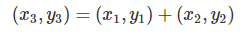
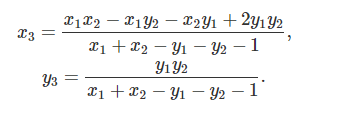
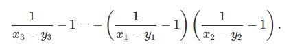
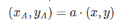
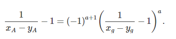

# Google CTF 2017 Quals
## Challenge details
|       Event        | Challenge | Category | Points  |
|:-------------------|:----------|:---------|:-------:|
|  Google CTF 2017 Quals | Backdoor |  Crypto   |     |

### Description
> 
### Attachments
> [crypto_backdoor.py](crypto_backdoor.py)
## Solution
题目为[Diffie-Hellman密钥交换技术](https://en.wikipedia.org/wiki/Diffie%E2%80%93Hellman_key_exchange)应用于一个[椭圆曲线加密](https://en.wikipedia.org/wiki/Elliptic-curve_cryptography)上。
其将加法  
  
定义为  
  
可以把形式转化为  
  
对于乘以a  
  
我们需要解  
   
可以使用[Pohlig–Hellman algorithm](https://en.wikipedia.org/wiki/Pohlig%E2%80%93Hellman_algorithm)
```python
from crypto_backdoor import *

# Modulus
p = 606341371901192354470259703076328716992246317693812238045286463
# g is the generator point.
g = (160057538006753370699321703048317480466874572114764155861735009, 255466303302648575056527135374882065819706963269525464635673824)
# Alice's public key A:
A = (460868776123995205521652669050817772789692922946697572502806062, 263320455545743566732526866838203345604600592515673506653173727)
# Bob's public key B:
B = (270400597838364567126384881699673470955074338456296574231734133, 526337866156590745463188427547342121612334530789375115287956485)

power = modinv(A[0]-A[1],p)-1
power = p-power
base = modinv(g[0]-g[1],p)-1

a = discrete_log(Mod(power,p), Mod(base,p))
print pow(base,a,p)==power

aliceMS = mul(a, B, p)
masterSecret = aliceMS[0]*aliceMS[1]
encrypted_message = encrypt(137737300119926924583874978524079282469973134128061924568175107915062758827931077214500356470551826348226759580545095568667325, masterSecret)
print Sn(encrypted_message,31)
```
得到flag：CTF{Anyone-can-make-bad-crypto}


## Link
https://en.wikipedia.org/wiki/Diffie%E2%80%93Hellman_key_exchange
https://en.wikipedia.org/wiki/Elliptic-curve_cryptography
https://en.wikipedia.org/wiki/Pohlig%E2%80%93Hellman_algorithm